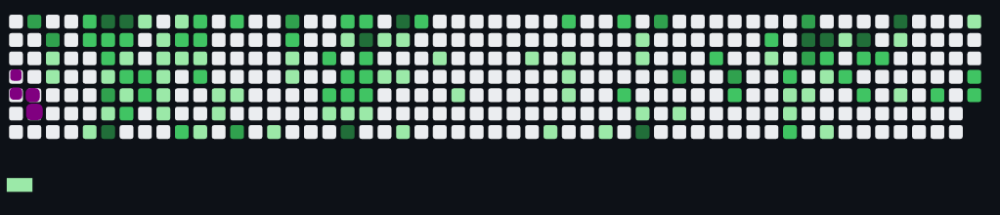

<h1 align="center">Привет, я <a href="https://xeney.github.io" target="_blank">Дамир</a> 
</h1>

---

### 👨‍💻 О себе

Я — разработчик с страстью к созданию инновационных решений и улучшению существующих подходов. Специализируюсь на разработке идей с использованием Python.

### 🛠️ Технологии и инструменты

- **Языки программирования**: Python
- Flask и Django для создания веб-приложений
- FastAPI для разработки API
- PostgreSQL, MySQL, MongoDB и SQLite
- SQLAlchemy и Django ORM
- HTML, CSS, SCSS
- RESTful API
- JWT, OAuth2
- NumPy для обработки массивов данных
- Pandas для анализа данных
- Matplotlib и Seaborn для визуализации данных
- Selenium
- Docker, Git
- pytest для юнит-тестов

### 📫 Контакты

- 📧 **Email**: [jeneksero@gmail.com](mailto:jeneksero@gmail.com)
- 💬 **Telegram**: [@Ghosers](https://t.me/Ghosers)
- 💼 **VK**: [vk.com/damir_varlamov](https://vk.com/damir_varlamov)

---

### 🎯 Мои цели

- Постоянное саморазвитие и изучение новых технологий.
- Участие в интересных проектах и получение нового опыта в сфере IT.

### 🙌 Спасибо за ваше время!
